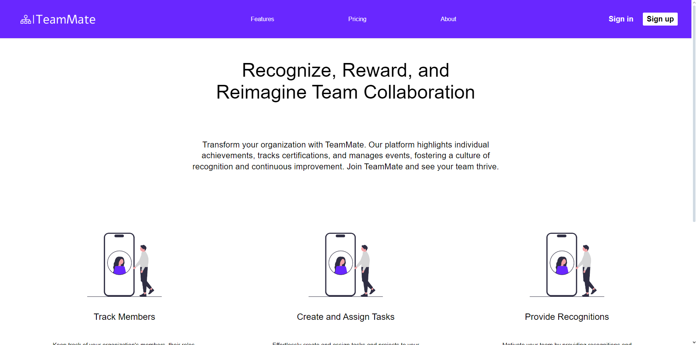
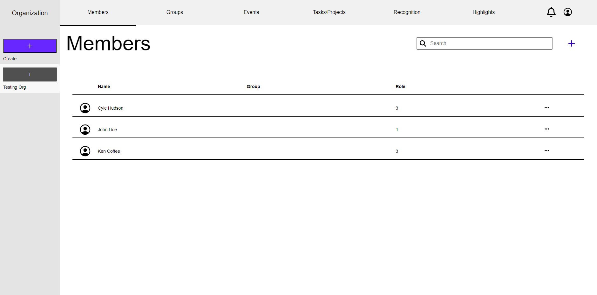
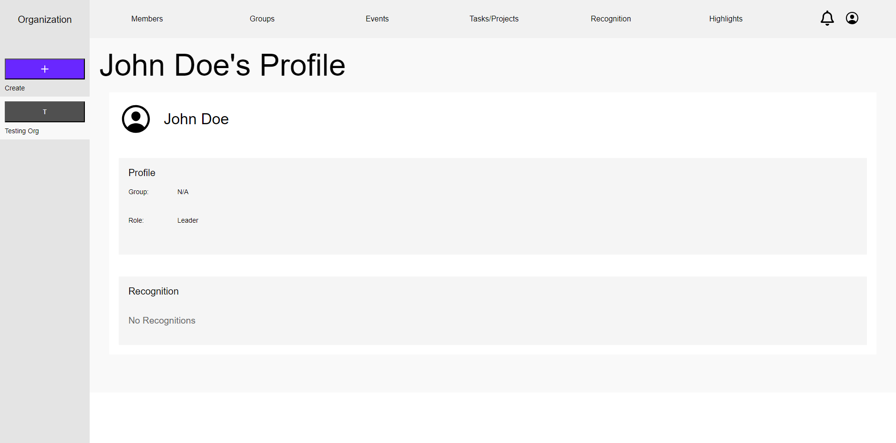
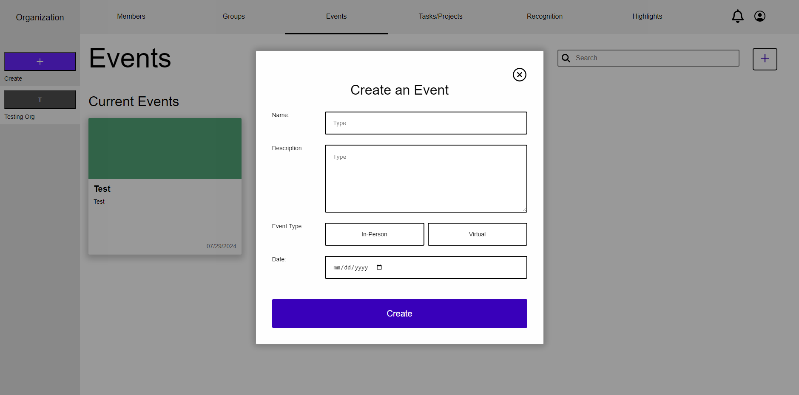
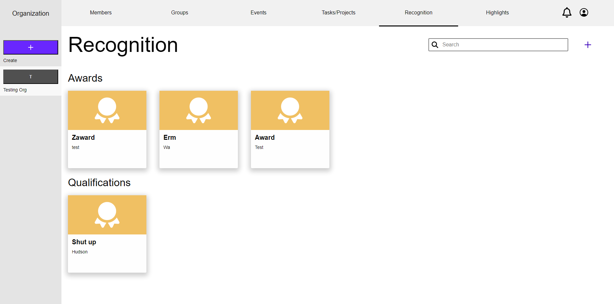

# TeamMate App
## Full-stack project from my senior capstone software engineering class.

React Frontend and Express Backend (with TypeScript) hosted on an AWS EC2 instance, supported by a MySQL RDS DBMS on an AWS RDS instance. 

The 186-page [FullDocumentation.pdf](https://drive.google.com/file/d/1R4iJww2ba9ebX2qCa5LUhnutjVem6KPq/view?usp=sharing) file describes our project, what it's meant to achieve, and who it's for. It also shows all of our work and software engineering process throughout the two-week lifecycle of the project. Included are the executive summary, use cases, competetive analysis, data definitions, prioritized functional requirements, non-functional requirements, technology stack, storyboards and mockups, wireframes, high level database architecture, high level APIs and algorithms, system design, high level application network and deployment design, usaility test plan, QA test plan, product summary, and post analysis. 

If you want to look at the source code or build the application yourself, all source files are included within the application folder. The database design files and .sql files are in the database folder. You'll need to change the credentials inside the backend app > database_queries > databaseConnection.ts to connect the backend to the db. 

If you want to see snapshots frozen in time, of our work as it progressed, look through the pdfs in the Milestones folder. 
## Preview Screenshots

